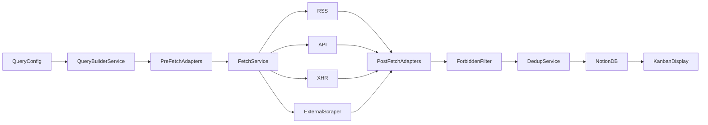

# Architecture

Small daily ETL: TypeScript core, GitHub Actions scheduler, Notion DB as kanban feed.  
~10–12 sources, in-memory pipeline, no intermediate storage.

## Data flow



### Pipeline stages

1. **Query Builder** — load conf, Zod-validate, pick enabled sources.
2. **Pre-fetch adapters** (per source) — query spec → fetch params (URL, headers, body).
3. **Fetch Service** (per type) — HTTP dispatch with retries, timeouts; `Promise.allSettled` per source.
4. **Post-fetch adapters** (per source) — raw payload → `JobOffer[]`.
5. **Forbidden filter** — drop offers whose title matches any conf `forbiddenStrings`.
6. **Dedup** — merge by `dedupKey` within the run.
7. **Notion sync** — upsert by `dedupKey`, truncate description.

**Routing rule:** type-level fetch mechanics (`sources/api/fetch.ts`), source-level adapters (`sources/api/<name>/query.ts` + `adapt.ts`).

## Source types

| Type | Role |
|------|------|
| RSS | Atom/JSON feeds |
| API | Public REST APIs |
| XHR | Hidden frontend APIs |
| External scraper | Output from an external scraping service |

No direct scraping, no inbound email parsing.

## Data model

```typescript
type RemotePolicy = "onsite" | "hybrid" | "remote" | "unknown"

interface JobOffer {
  id: string           // random UUID — internal only
  dedupKey: string     // title + company + source — dedup + Notion upsert
  title: string
  company: string
  url: string
  location: string
  remote: RemotePolicy
  salary: string
  description: string  // truncated to ~1900 chars before Notion
  publishedAt: string // plain string, no Date objects
  source: string       // e.g. "greenhouse:acme"
}
```

### Identity

| Field | Purpose |
|-------|---------|
| `id` | Random UUID at adapt time. Not used for dedup or Notion lookup. |
| `dedupKey` | `normalize(title) \| company \| source` (lowercase, trim). In-run dedup + cross-run Notion upsert. |

Dedup collision within a run: keep one winner (arbitrary or longer description).

## Config

YAML per query profile. Multiple conf files → multiple GHA actions; all write to the **same** Notion DB (no profile property on rows).

```yaml
forbiddenStrings:
  - intern
  - stage

sources:
  - id: acme-greenhouse
    type: api
    enabled: true
    query:
      keywords: ["typescript"]
      remote: remote
```

- `forbiddenStrings` — optional, default `[]`. Case-insensitive substring match on **title**; silent drop, not an error.
- Secrets via GitHub Secrets only (`NOTION_TOKEN`, `NOTION_DATABASE_ID`, per-source keys).

## Notion

- One database, all jobs.
- Properties: Title, Company, URL, Location, Remote (select), Salary, Description (truncated), PublishedAt (text), Source, DedupKey (upsert key).
- On run: load `dedupKey → pageId` map (optionally cached in GHA between runs).
- Rate-limited sequential writes (~300ms or client retry).
- No stale-job lifecycle — out of scope.

## Error handling

- Per-source errors collected in memory; pipeline continues.
- GHA uploads error log artifact **only when non-empty**.
- Exit code 1 if errors occurred (warning), successful sources still sync.

## Repo layout

```
src/
  cli/run.ts
  core/
    query-builder.ts
    fetch-service.ts
    filter.ts
    dedup.ts
    notion-sync.ts
    error-log.ts
  types/
  sources/
    registry.ts
    api/
      fetch.ts
      <source>/
        query.ts      # pre-fetch adapter
        adapt.ts      # post-fetch adapter
        fixtures/
    rss/ ...
    xhr/ ...
    external-scraper/ ...
configs/
.github/workflows/
  aggregate.yml
  test-payload.yml
```

## GitHub Actions

| Workflow | Trigger | Purpose |
|----------|---------|---------|
| `aggregate.yml` | Cron (daily) | Full pipeline for a conf file |
| `test-payload.yml` | `workflow_dispatch` | Fetch raw payload for one source; artifact only, no Notion |

Caching: npm (`setup-node`), optional Notion pageId map.

## Out of scope

- JSON run artifacts
- Stale job archival / deletion
- Job lifecycle management beyond kanban feed
- CI test gate (tests exist, run manually)
