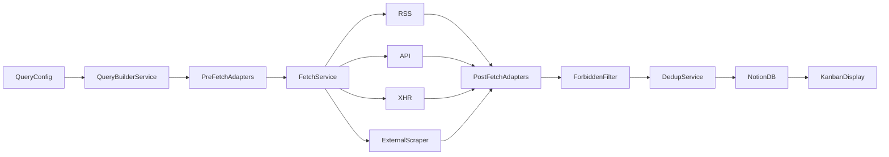

# Architecture

Small daily ETL: TypeScript core, GitHub Actions scheduler, Notion DB as kanban feed.  
~10–12 sources, in-memory pipeline, no intermediate storage.

## Data flow



### Pipeline stages

1. **Query Builder** — load conf, Zod-validate, pick enabled sources (`load-config.ts` + CLI).
2. **Pre-fetch adapters** (per provider) — conf query → fetch params (URL, headers, body).
3. **Fetch Service** (per type) — HTTP dispatch with retries, timeouts; `Promise.allSettled` per source.
4. **Post-fetch adapters** (per provider) — raw payload → `JobOffer[]`.
5. **Forbidden filter** — drop offers whose title matches any conf `forbiddenStrings`.
6. **Dedup** — merge by `dedupKey` within the run.
7. **Description truncate** — hard-slice descriptions via `truncate.ts` (`processOffers()` in `pipeline.ts`).
8. **Notion sync** — upsert by `dedupKey`; skipped when there are no offers to write.

**Routing rule:** type-level fetch mechanics (`sources/api/fetch.ts`), provider-level adapters (`sources/api/<provider>/`). Registry maps conf `provider` → adapter folder.

**Adapter contract:** each provider folder exports `buildQuery(confQuery) → FetchParams` and `adapt(rawPayload) → JobOffer[]`, plus a co-located Zod schema for conf query validation. Adapters must normalize `publishedAt` to ISO 8601 (`YYYY-MM-DDTHH:mm:ssZ`).

## Source types

| Type | Role |
|------|------|
| RSS | Atom/JSON feeds |
| API | Public REST APIs |
| XHR | Hidden frontend APIs |
| External scraper | Output from an external scraping service |

No direct scraping, no inbound email parsing.

### v1 provider: Adzuna

First end-to-end source: [Adzuna API](https://developer.adzuna.com/) (`provider: adzuna`, country `fr`).

- Auth: `app_id` + `app_key` (GitHub Secrets `ADZUNA_APP_ID`, `ADZUNA_APP_KEY`).
- Fetch: page 1 only, `results_per_page` hardcoded to 50 in `query.ts`.
- Conf query fields: `country`, `what`, `where`, `what_exclude`.
- Adapt mapping:
  - `url` ← `redirect_url` (as-is)
  - `location` ← `location.display_name`
  - `publishedAt` ← `created`, normalized to ISO 8601
  - `remote` ← always `"unknown"`
  - `salary` ← `"min - max CUR"` when both bounds present; `"min+ CUR"` when only min; `""` otherwise
  - `description` ← strip HTML tags, decode entities → plain text (truncated in pipeline before Notion)
  - `company` ← `company.display_name`, or `unknown (#####)` where `#####` is the first 5 decimal digits of a hash of `url` (zero-padded)

## Data model

```typescript
type RemotePolicy = "onsite" | "hybrid" | "remote" | "unknown"

interface JobOffer {
  dedupKey: string     // normalize(title) | normalize(company) — dedup + Notion upsert
  title: string
  company: string
  url: string
  location: string
  remote: RemotePolicy
  salary: string
  description: string  // truncated to 1900 chars + "…" before Notion
  publishedAt: string  // ISO 8601, no Date objects in pipeline
  source: string       // profile label, e.g. "adzuna-remote" — provenance only
}
```

### Identity

| Field | Purpose |
|-------|---------|
| `dedupKey` | `normalize(title) \| normalize(company)`. In-run dedup + cross-run Notion upsert. `source` is not part of the key — same job from different profiles or providers collapses to one row. |
| `source` | Conf profile label (`adzuna-remote`, …). Metadata / Notion Source property only. |

**`normalize()`** (shared by title and company): lowercase, trim, collapse internal whitespace, strip punctuation.

Dedup collision within a run: keep first winner (stable by source order in conf).

## Config

One self-contained YAML file per query profile. Multiple conf files → single `aggregate.yml` workflow with a matrix; all write to the **same** Notion DB.

```yaml
forbiddenStrings:
  - intern
  - stage

sources:
  - id: adzuna-remote
    type: api
    provider: adzuna
    enabled: true
    query:
      country: fr
      what: typescript
      where: paris
      what_exclude: intern
```

- `forbiddenStrings` — optional, default `[]`. Case-insensitive substring match on **title**; silent drop, not an error.
- `provider` — selects adapter folder under `sources/<type>/` (e.g. `adzuna` → `sources/api/adzuna/`).
- `id` — profile label; becomes `JobOffer.source`. One source entry per conf file in v1.
- Secrets: copy `.env.example` → `.env.local` locally (`NOTION_TOKEN`, `NOTION_DATABASE_ID`, `ADZUNA_APP_ID`, `ADZUNA_APP_KEY`, plus per-provider keys as needed). In GitHub Actions, paste the filled-in file into the `ENVLOCAL` repository secret; the workflow writes it to `.env.local` before each run.

## Notion

- One database, all jobs.
- Properties: Title, Company, URL, Location, Remote (select), Salary, Description (truncated), PublishedAt (text), Source, DedupKey (upsert key).
- On run: full DB query to load `dedupKey → pageId` map (no GHA cache in v1).
- Sequential writes; application-level retry on 429 / rate-limited and 5xx responses (same backoff as fetch — 3 retries, exponential).
- No stale-job lifecycle — out of scope.

## Error handling

- Per-source errors collected in memory; pipeline continues.
- Error log path defaults to `errors.log`; override with optional `ERROR_LOG_PATH` env var.
- GHA uploads error log artifact **only when non-empty**.
- Exit code 1 only if **all** sources failed or Notion sync failed; partial success is OK.

## Fetch defaults

- 3 retries with exponential backoff.
- 30s timeout per request.

## Repo layout

```
src/
  cli/run.ts
  cli/test-payload.ts    # local raw payload capture → fixture
  core/
    load-config.ts       # YAML conf load + Zod validate (query-builder stage)
    normalize.ts         # normalize(), makeDedupKey()
    filter.ts
    dedup.ts
    truncate.ts          # description hard-slice before Notion
    fetch-service.ts     # phase 2+
    notion-sync.ts       # phase 5+
    error-log.ts         # phase 5+
  test/
    job-offer-fixture.ts # shared test factory
  types/
    config.ts
    job-offer.ts
  sources/
    registry.ts
    api/
      fetch.ts
      adzuna/
        schema.ts         # Zod query schema
        query.ts          # buildQuery
        adapt.ts
    rss/ ...
    xhr/ ...
    external-scraper/ ...
configs/
  adzuna-remote.yaml
  adzuna-not-remote.yaml
payloads/                 # gitignored captured API responses
.github/workflows/
  aggregate.yml
```

## GitHub Actions

| Workflow | Trigger | Purpose |
|----------|---------|---------|
| `aggregate.yml` | Cron `0 7 * * *` with `timezone: "Europe/Paris"` + `workflow_dispatch` | Matrix over `configs/*.yaml`; full pipeline per conf |

Matrix jobs run **sequentially** (`max-parallel: 1`) so each job sees prior upserts and avoids duplicate Notion rows from concurrent writes.

Caching: npm (`setup-node`).

## Tooling

- ESM (`"type": "module"`).
- Tests: `node:test` + `tsx` — hand-run, no CI gate.
- Payload capture: `npm run test-payload -- --conf configs/<profile>.yaml` → `payloads/<profile>.json` (gitignored, local CLI, not a GHA workflow).

## Out of scope

- JSON run artifacts
- Stale job archival / deletion
- Job lifecycle management beyond kanban feed
- CI test gate (tests exist, run manually)
- `test-payload.yml` GHA workflow
